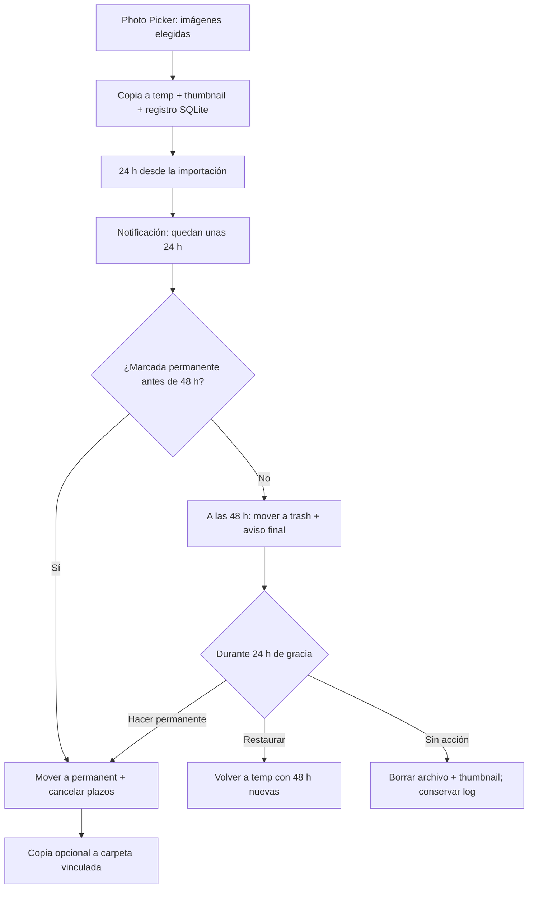

# Arquitectura de CineVault 48 para Galaxy S25 Ultra

## Decisión de plataforma

La aplicación es Android nativa. En un S25 Ultra, un servidor Flask ejecutado en Termux puede ser suspendido por Android y obliga a mantener una terminal y un proceso web. La versión nativa usa:

- Kotlin y una interfaz táctil Material 3.
- `SQLiteOpenHelper` para SQLite sin ORM.
- `WorkManager` para mantenimiento persistente en segundo plano.
- Photo Picker para conceder acceso solo a imágenes seleccionadas.
- Almacenamiento específico de la app para que las temporales no aparezcan mezcladas con la galería normal.
- Storage Access Framework para copiar permanentes a una carpeta elegida de Google Drive, Dropbox o almacenamiento local.

## Ciclo de vida



Hay dos avisos: uno preventivo 24 h antes de entrar en papelera y otro al entrar en papelera, cuando quedan 24 h para el borrado físico. El mantenimiento se solicita cada hora. Android puede retrasar una ejecución para ahorrar batería; los plazos se guardan como instantes UTC en SQLite, por lo que un retraso nunca provoca un borrado anticipado. El trabajo se realiza en la primera ejecución que ocurra después del plazo.

## Estructura física en el teléfono

```text
Android/data/com.vidal.cinevault[.debug]/files/Pictures/CineVault48/
├── temp/          # originales importados, retención de 48 h
├── permanent/     # originales protegidos de la limpieza
├── trash/         # originales en gracia de 24 h
└── thumbnails/    # JPEG ligeros para el grid

Android/data/com.vidal.cinevault[.debug]/databases/
└── cinevault.db   # ruta interna administrada por Android
```

La aplicación genera UUID para los nombres físicos. Proyecto, nombre original, tipo y notas viven en SQLite; ningún texto introducido por el usuario se utiliza como ruta.

## Esquema SQLite

El SQL completo y ejecutable está en `docs/DATABASE.sql`.

| Tabla | Propósito | Claves importantes |
| --- | --- | --- |
| `proyectos` | Catálogo de proyectos sin duplicados por mayúsculas/minúsculas | `id`, `name`, `created_at` |
| `imagenes` | Índice, metadatos y estado del ciclo de vida | UUID, proyecto, rutas, tipo, estado, plazos, tamaño y resolución |
| `logs` | Auditoría append-only de importación, aviso, movimiento, simulación y borrado | imagen, acción, detalle y fecha |

Los tiempos son enteros Unix epoch en milisegundos. `deleted` conserva una fila tombstone y el log, pero vacía las rutas tras eliminar físicamente los archivos.

## Módulos y responsabilidades

| Módulo | Responsabilidad |
| --- | --- |
| `core/ScreenshotManager.kt` | `addImage`, `markPermanent`, `checkExpired`, papelera, borrado, restauración, búsqueda y modo simulación |
| `data/CineVaultDatabase.kt` | Creación de tablas, índices, consultas y actualizaciones SQLite |
| `core/LifecyclePolicy.kt` | Cálculo puro de 48 h, aviso a 24 h y gracia de 24 h |
| `core/UriImporter.kt` | Convierte URIs del Photo Picker en archivos privados temporales |
| `core/SyncFolderManager.kt` | Copia unidireccional de permanentes al proveedor elegido |
| `work/MaintenanceWorker.kt` | Pase periódico: notificación, mover a papelera y purgar |
| `notifications/ExpiryNotifier.kt` | Canal y notificación agrupada con la lista afectada |
| `ui/MainActivity.kt` | Grid, filtros, selección múltiple, importación, ajustes y papelera |
| `ui/ImageAdapter.kt` | Thumbnails, badges y pulsación larga/checkbox |
| `ui/DetailActivity.kt` | Vista completa, compartir, restaurar y hacer permanente |
| `assets/config.json` | Tiempos, tamaño de thumbnail, lote máximo, avisos y valor inicial de `dry_run` |

## Operaciones y consistencia

1. La copia entra primero en la ruta de destino.
2. Se crea el thumbnail.
3. Se inserta SQLite; si falla, se retiran ambos archivos.
4. En movimientos, el archivo se mueve primero y se actualiza SQLite después. Si la actualización falla, se intenta devolver el archivo a su origen.
5. Antes de borrar, la ruta canónica debe estar dentro de la raíz administrada. Esto impide borrar accidentalmente una ruta externa.
6. El modo simulación afecta a movimientos y borrados automáticos/manuales, pero no impide que el usuario marque una imagen como permanente.

## Integración local y cloud

### Opción A — implementada y recomendada

El sistema funciona offline. Desde **Ajustes → Carpeta de copia**, Android abre sus proveedores documentales. Al elegir una carpeta local, de Drive o Dropbox:

- se copian allí todas las permanentes existentes;
- cada nueva permanente se copia o reemplaza automáticamente;
- temporales y papelera nunca se suben;
- desvincular o desinstalar la app no borra las copias externas.

Es una réplica unidireccional, no una sincronización conflictiva de dos vías.

### Opción B — backend multi-dispositivo, no incluida en v1

Solo compensa si se necesita compartir proyectos entre varios móviles o usuarios. Requiere autenticación, API HTTPS, base de datos de servidor y almacenamiento de objetos con reglas de ciclo de vida. SQLite y el disco del proceso web no sirven como almacenamiento cloud duradero. La app ya separa la lógica de almacenamiento, por lo que puede añadirse un `RemoteRepository` en una v2 sin cambiar el ciclo local.
