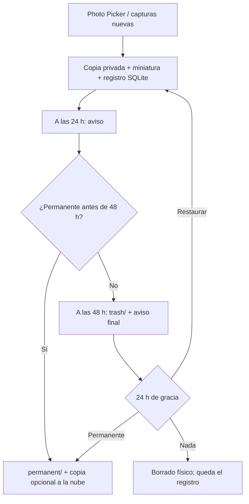

# CineVault 48

[](https://github.com/egodivergente/CineVault48/actions/workflows/build-apk.yml)
[](LICENSE)

Galería Android para imágenes de usar y tirar: capturas, referencias y fotogramas generados con IA que solo necesitas unos días. Cada imagen caduca a las **48 horas** salvo que la marques como permanente, pasa **24 horas** en una papelera recuperable y después se borra sola. Así la galería principal del móvil no se llena de material temporal.

**[Descargar el APK](https://github.com/egodivergente/CineVault48/releases/latest)** · Android 9 o superior

## Qué hace

- **Importa** imágenes con el Photo Picker de Android (solo las que eliges) o, si das permiso, **capturas de pantalla nuevas automáticamente**.
- **Organiza** por proyectos, tipo y estado, con búsqueda, filtros y selección múltiple.
- **Ciclo de vida automático**: aviso 24 h antes de ir a la papelera, aviso al entrar en ella y borrado físico al terminar la gracia. Restaurar devuelve otras 48 h.
- **Permanentes**: lo que marcas se protege de la limpieza y puede copiarse a una carpeta local, de Google Drive o de Dropbox.
- **Modo simulación**: registra qué se movería o borraría sin tocar ningún archivo, para revisar antes de usarlo con material real.

## Lo técnicamente interesante



- **Plazos que nunca se adelantan**: Android puede retrasar los trabajos en segundo plano para ahorrar batería. Los plazos se guardan como instantes UTC en SQLite y `WorkManager` revisa cada hora, así que un retraso solo puede hacer que algo se borre más tarde, nunca antes.
- **Política de retención pura** (`LifecyclePolicy`): el cálculo de 48 h, aviso y gracia no depende de Android y se prueba con un reloj inyectable.
- **Operaciones consistentes entre disco y base de datos**: la copia y la miniatura se crean antes del registro y se retiran si falla; en los movimientos, si SQLite no se actualiza, el archivo vuelve a su origen.
- **Borrado seguro**: antes de borrar se comprueba que la ruta canónica está dentro de la carpeta de la app. Los archivos se guardan con nombres UUID; ningún texto del usuario se usa como ruta.
- **Auditoría**: tabla `logs` de solo inserción con importaciones, avisos, movimientos, simulaciones y borrados. Las imágenes borradas quedan como registro sin rutas.
- **Privacidad por diseño**: almacenamiento específico de la app (no se mezcla con la galería), Photo Picker en vez de acceso a toda la biblioteca y copia a la nube unidireccional solo de las permanentes, vía Storage Access Framework y sin credenciales en la app.

Más detalle en [Arquitectura](docs/ARCHITECTURE.md), [esquema SQLite](docs/DATABASE.sql) e [instalación](docs/DEPLOYMENT.md).

## Tecnologías

Kotlin · Material 3 (Views) · SQLite con `SQLiteOpenHelper`, sin ORM · WorkManager · Photo Picker y MediaStore · Storage Access Framework · Gradle 8.13 con AGP 8.13 · GitHub Actions.

## Compilar

Requisitos: JDK 17, Android SDK 36 y Gradle 8.13 (el repositorio no incluye wrapper).

```bash
git clone https://github.com/egodivergente/CineVault48.git
cd CineVault48
gradle :app:testDebugUnitTest   # tests unitarios
gradle :app:assembleDebug       # APK en app/build/outputs/apk/debug/
```

También puedes abrir la carpeta con Android Studio y pulsar **Run**. Cada push a `main` compila el APK en GitHub Actions y lo deja como artefacto.

## Estado

Prototipo funcional en desarrollo. El proyecto de la raíz es el actual; `CineVault48-source/` es una copia anterior que queda pendiente de consolidar.

El APK publicado es una compilación de depuración firmada en CI.

## Licencia

[MIT](LICENSE) © 2026 Egodivergente
